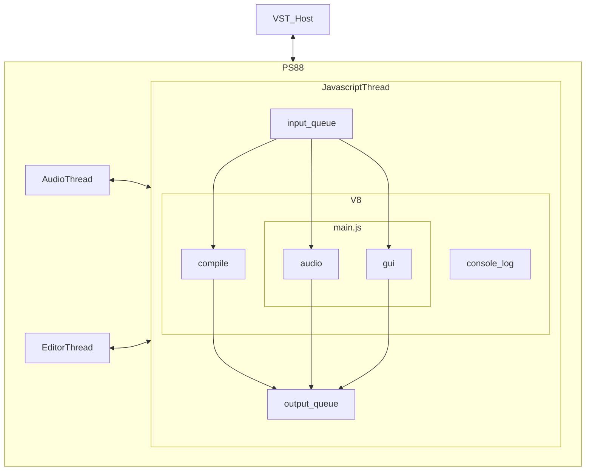

# 構成図

```mermaid
graph TD
    VST_Host

    subgraph PS88
        AudioThread
        EditorThread

        subgraph JavascriptThread
            input_queue
            output_queue
            subgraph V8
                compile
                subgraph main.js
                    audio
                    gui
                end
                console_log
            end
            input_queue --> compile
            input_queue --> audio
            input_queue --> gui
            compile --> output_queue
            audio --> output_queue
            gui --> output_queue
        end

        AudioThread <--> JavascriptThread
        EditorThread <--> JavascriptThread
    end

    VST_Host <--> PS88
```
